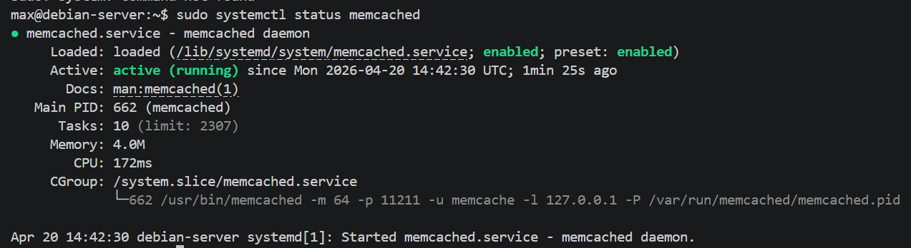

# Домашнее задание к занятию «Кеширование Redis/memcached» - Моськов Максим

### Задание 1. Примеры проблем, которые решает кэширование

Кеширование — это способ хранить часто запрашиваемые данные в быстром хранилище (обычно в оперативной памяти), чтобы не обращаться каждый раз к медленному источнику. Вот типичные проблемы, которые оно решает:

Высокая нагрузка на базу данных. Если тысячи пользователей одновременно запрашивают одни и те же данные (например, главную страницу интернет-магазина со списком товаров), БД не выдержит такого количества одинаковых запросов. Кеш берёт эту нагрузку на себя — результат запроса один раз вычисляется и потом отдаётся из памяти.

Медленные ответы приложения. Чтение из оперативной памяти занимает микросекунды, а запрос к БД с JOIN-ами по нескольким таблицам — десятки или сотни миллисекунд. Кеш ускоряет отдачу данных в десятки раз.

Дорогие вычисления. Если для формирования ответа нужно агрегировать данные, делать сложные расчёты или дёргать внешние API (платные или с лимитами), имеет смысл кешировать результат на какое-то время.

Хранение сессий пользователей. Сессионные данные (токены, корзины, временные настройки) часто хранят в Redis/Memcached — это быстро и не нагружает основную БД.

Rate limiting и счётчики. Подсчёт количества запросов от пользователя за период времени, счётчики просмотров, лайков — всё это удобно и быстро считается в Redis.

Разгрузка внешних API. Если ты дёргаешь стороннее API, у которого есть лимит запросов или оно платное, кеш позволяет уменьшить количество реальных обращений.

Pub/Sub и очереди. Redis умеет быть брокером сообщений между сервисами (хотя это уже немного за рамками чистого "кеширования").

### Задание 2. Установка и запуск Memcached

sudo apt update
sudo apt install -y memcached
sudo systemctl start memcached
sudo systemctl enable memcached
sudo systemctl status memcached

### Задание 3. TTL в Memcached

