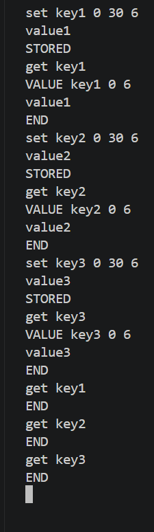
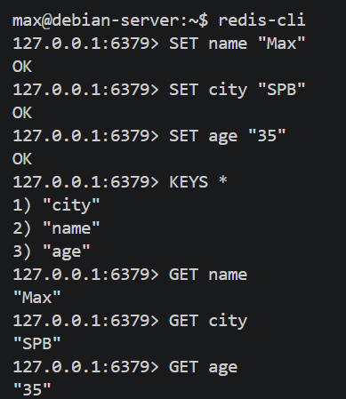
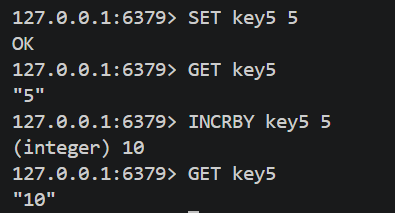

# Домашнее задание к занятию «Кеширование Redis/memcached» - Моськов Максим

---

## Задание 1. Примеры проблем, которые решает кеширование

Кеширование — это способ хранить часто запрашиваемые данные в быстром хранилище (обычно в оперативной памяти), чтобы не обращаться каждый раз к медленному источнику. Типичные проблемы, которые оно решает:

- **Высокая нагрузка на базу данных.** Если тысячи пользователей одновременно запрашивают одни и те же данные (например, главную страницу интернет-магазина со списком товаров), БД не выдержит такого количества одинаковых запросов. Кеш берёт эту нагрузку на себя — результат запроса один раз вычисляется и потом отдаётся из памяти.

- **Медленные ответы приложения.** Чтение из оперативной памяти занимает микросекунды, а запрос к БД с JOIN-ами по нескольким таблицам — десятки или сотни миллисекунд. Кеш ускоряет отдачу данных в десятки раз.

- **Дорогие вычисления.** Если для формирования ответа нужно агрегировать данные, делать сложные расчёты или дёргать внешние API (платные или с лимитами), имеет смысл кешировать результат на какое-то время.

- **Хранение сессий пользователей.** Сессионные данные (токены, корзины, временные настройки) часто хранят в Redis/Memcached — это быстро и не нагружает основную БД.

- **Rate limiting и счётчики.** Подсчёт количества запросов от пользователя за период времени, счётчики просмотров, лайков — всё это удобно и быстро считается в Redis.

- **Разгрузка внешних API.** Если приложение дёргает стороннее API, у которого есть лимит запросов или оно платное, кеш позволяет уменьшить количество реальных обращений.

- **Pub/Sub и очереди.** Redis умеет быть брокером сообщений между сервисами (хотя это уже немного за рамками чистого «кеширования»).

---

## Задание 2. Установка и запуск Memcached

Устанавливаем и запускаем сервис:

```bash
sudo apt update
sudo apt install -y memcached
sudo systemctl start memcached
sudo systemctl enable memcached
sudo systemctl status memcached
```


---

## Задание 3. Удаление по TTL в Memcached

Подключаемся к Memcached:

```bash
telnet 127.0.0.1 11211
```

Записываем три ключа с TTL и проверяем, что спустя указанное время они удаляются:

```
set key1 0 30 6
value1
set key2 0 30 6
value2
set key3 0 30 6
value3
get key1
get key2
get key3
```

После записи ключи сразу доступны через `get`, а спустя 30 секунд на каждый `get` сервер отвечает только `END` — значения удалены по TTL.



> **P.S.** Поставил TTL 30 секунд вместо 5, так как не успевал быстро вводить команды в telnet. На суть задания это не влияет — механизм удаления по TTL отрабатывает одинаково.

---

## Задание 4. Запись данных в Redis

Устанавливаем и запускаем Redis:

```bash
sudo apt install -y redis-server
sudo systemctl start redis-server
sudo systemctl enable redis-server
sudo systemctl status redis-server
```

Заходим в CLI и записываем ключи, затем читаем их обратно:

```bash
redis-cli
```

```
SET name "Max"
SET city "Moscow"
SET age "25"
KEYS *
GET name
GET city
GET age
```



---

## Задание 5*. Работа с числами

В том же `redis-cli` создаём ключ `key5` со значением `5` и увеличиваем его на `5` через `INCRBY`:

```
SET key5 5
GET key5
INCRBY key5 5
GET key5
```

После `INCRBY key5 5` Redis возвращает `(integer) 10`, а `GET key5` показывает `"10"`.

